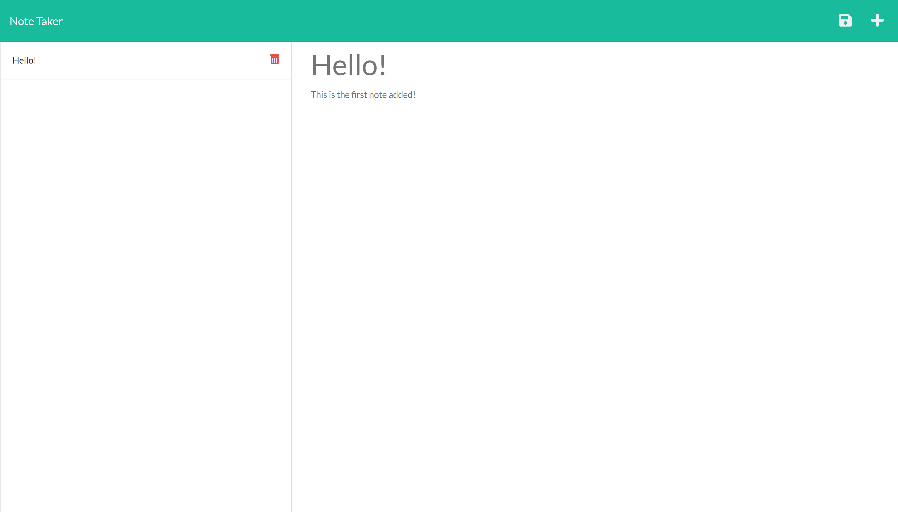

# Note Taker

## Description

This application will allow you to write, save, and delete notes using express.js.

## Table of Contents

- [Access](#access)
- [Usage](#usage)
- [Questions](#questions)

## Access

It is accessed here: [https://archies-note-taker.herokuapp.com/](https://archies-note-taker.herokuapp.com/)

## Usage

Hit the plus icon on the top right of the screen to add a new note. once a title and description are added, hit the save icon on the top right to save it. You can click on any saved notes to view them, and click the red trashcan to delete them

## Questions

Have questions? feel free to reach me here:

archied5150@yahoo.com
https://github.com/ArchieDonaho